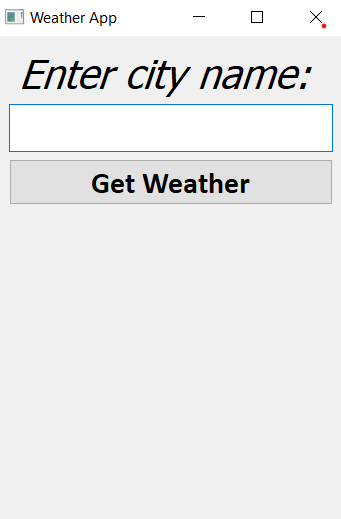
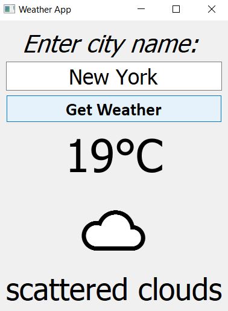
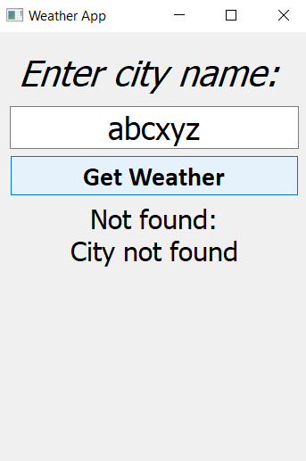

# 🌦️ Weather App

A modern desktop weather application built with **Python** and **PyQt5** that provides real-time weather information using the **OpenWeatherMap API**.

---

# 📸 Screenshots

## Home Screen



---

## Weather Result



---

## Invalid City



---

# ✨ Features

- 🌍 Search weather by city name
- 🌡️ Real-time temperature display
- ☀️ Dynamic weather emojis
- 📝 Weather description
- 🚨 Handles invalid city names
- 🌐 Handles internet connection errors
- 🔐 API key stored securely using `.env`
- 🎨 Clean desktop interface built with PyQt5

---

# 🛠️ Built With

- Python 3
- PyQt5
- Requests
- python-dotenv
- OpenWeatherMap API

---

# 📂 Project Structure

```
Weather-app/
│
├── assets/
│   └── screenshots/
│
├── .env
├── .gitignore
├── LICENSE
├── main.py
├── README.md
├── requirements.txt
└── test.py
```

---

# 🚀 Installation

Clone the repository

```bash
git clone https://github.com/YOUR_USERNAME/Weather-app.git
```

Move into the project

```bash
cd Weather-app
```

Install dependencies

```bash
pip install -r requirements.txt
```

Create a `.env` file

```env
API_KEY=YOUR_OPENWEATHERMAP_API_KEY
```

Run the application

```bash
python main.py
```

---

# 🌤️ Weather Information

The application displays:

- 🌡️ Temperature
- ☀️ Weather Emoji
- 📄 Weather Description

---

# 🚨 Error Handling

The application handles:

- Invalid city names
- Invalid API key
- Internet connection errors
- Request timeout
- Server errors
- Unexpected API responses

---

# 📌 Future Improvements

- 📍 Current location weather
- 📅 5-Day forecast
- 🕒 Hourly forecast
- ❤️ Favorite cities
- 🌙 Dark mode
- 🌡️ Celsius/Fahrenheit switch
- Search history

---

# 🤝 Contributing

Contributions are welcome!

Fork the repository, create a new branch, commit your changes, and submit a Pull Request.

---

# 📜 License

This project is licensed under the MIT License.

---

# 👨‍💻 Author

**Jayanth Reddy M**

GitHub: https://github.com/jayanthcodes1309